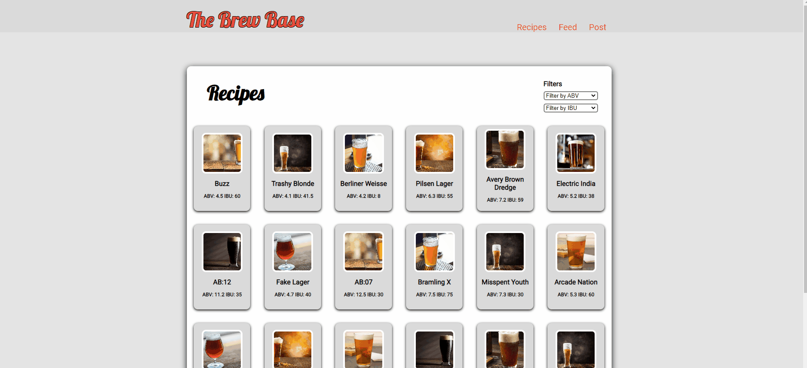

# The Beer Base

A dynamic HTML, CSS, and JavaScript application for homebrewers looking to try new recipes and post their batches online.

## Why I Built This

As a beer-enjoyer and occassional homebrewer, I wanted to create an application that allows for easy access to beer brewing recipes and an environment for individual to post the batches their proud of.

## Technologies Used

- Core JavaScript
- HTML5
- CSS3
- AJAX

## Features

- Users can view and click on a list of "thumbnail" beer-brewing recipes
- Users can click through a carousel that explains the background of The Beer Base
- Users can create posts of the batches they've brewed
- Users can view posts they've made
- Users can edit posts they've made
- Users can delete posts they've made

## Preview

## Reach Feature

- Add filtering functionality for the beer recipes thumbnail list

## Getting Started

1. Clone the repository
2. Open index.html in your LiveReload Server
3. Explore the app!
